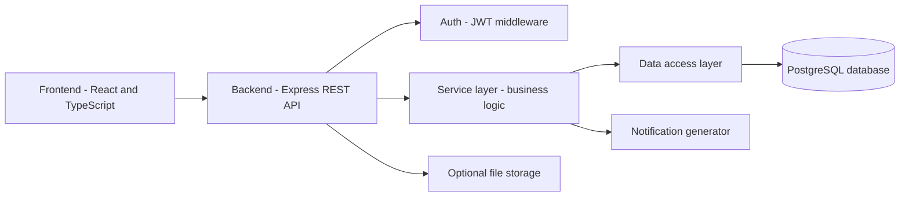
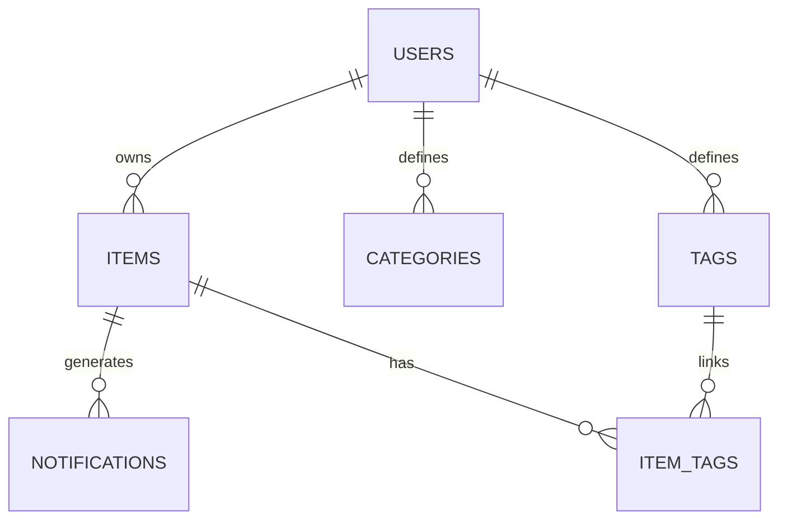
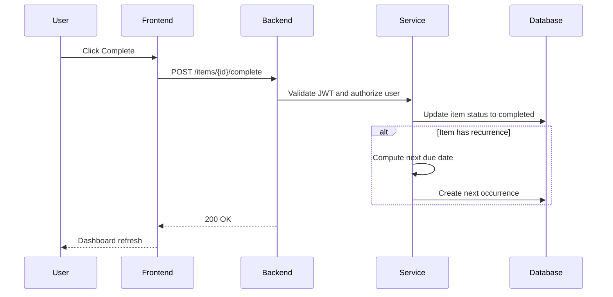

# System Design
**Project:** Personal Logistics and Life Administration Tracker  
**Team:** AdminOPs  
**Members:** James Rhodes,Shane Stroud
**Date:** 02/06/2026

---

## 1. Design Overview
This document translates the project requirements into a technical design. The system is a full-stack web application that provides secure user accounts, life-admin item tracking, dashboard summaries, recurrence logic, and in-app notifications with persistent storage in PostgreSQL.

---

## 2. System Architecture

### 2.1 Architecture Style
Client–server application using a layered design:

- **Presentation Layer:** React + TypeScript UI  
- **API Layer:** Express REST API (controllers/routes)  
- **Service Layer:** Business logic (recurrence, urgency/status, notifications)  
- **Data Access Layer:** DB queries/repositories  
- **Database Layer:** PostgreSQL  

### 2.2 High-Level Architecture Diagram

---

## 3. Technology Choices

### 3.1 Front End
- React + TypeScript
- React Router (routing)
- React Hook Form + Zod (forms + validation) (recommended)

### 3.2 Back End
- Node.js + Express
- JWT authentication (stateless auth for APIs)
- bcrypt (password hashing)

### 3.3 Database
- PostgreSQL
- Migrations tool (choose one): Prisma Migrate, Knex migrations, or Sequelize migrations

### 3.4 Testing
- Jest (unit tests)
- Supertest (API integration tests)
- Optional stretch: Playwright/Cypress (UI smoke tests)

---

## 4. Data Model Design

### 4.1 Tables (Proposed)
- `users` (id, email, password_hash, created_at)
- `items` (id, user_id, title, notes, due_date, status, recurrence_type, recurrence_interval, archived_at, created_at)
- `categories` (id, user_id, name)
- `tags` (id, user_id, name)
- `item_tags` (item_id, tag_id)
- `notifications` (id, user_id, item_id, type, message, is_read, created_at)
- `attachments` (optional) (id, item_id, filename, mime_type, size_bytes, storage_path, uploaded_at)

### 4.2 ER Diagram

### 4.3 Indexing Strategy
- `items(user_id, due_date)` for due-date ordering and range queries
- `items(user_id, status, due_date)` for dashboard buckets
- `notifications(user_id, is_read, created_at)` for notification center queries
- `item_tags(item_id)` and `item_tags(tag_id)` for tag filtering

---

## 5. Core Business Logic Design

### 5.1 Status and Urgency Rules
**Statuses:**
- `pending`
- `completed`
- `overdue`
- `archived`

**Rules:**
- An item is **overdue** if `due_date < today` AND status is not `completed` or `archived`.
- Dashboard time windows:
  - **Overdue:** overdue items
  - **Due Soon:** due within next 7 days
  - **Upcoming:** due within next 30 days (excluding due soon)

### 5.2 Recurrence Engine
**Supported recurrence:**
- `none`
- `weekly`
- `monthly`
- `yearly`

**Generation rule (on completion):**
- weekly: `due_date + 7 days`
- monthly: same day next month (clamp to last valid day if needed)
- yearly: same month/day next year (handle leap-year rules)

**Duplicate prevention (idempotency):**
- Add a field like `generated_from_item_id` on the newly created occurrence and enforce uniqueness, OR
- Store `last_completed_at` and check before generating the next occurrence.

### 5.3 Notification Generator
**Notification events:**
- Due soon thresholds (example: 7/3/1 days before due date)
- Overdue detection (due date passed)

**Implementation approach:**
- MVP: generate due-soon and overdue notifications when loading the dashboard and/or on item updates.
- Optional stretch: scheduled job runs daily to generate notifications.

---

## 6. API Design (REST)
Base path: `/api`  
All protected routes require: `Authorization: Bearer <token>`

### 6.1 Auth
- `POST /auth/register`
- `POST /auth/login`

### 6.2 Items
- `GET /items` (supports filters/sorting via query params)
- `POST /items`
- `GET /items/:id`
- `PUT /items/:id`
- `DELETE /items/:id`
- `POST /items/:id/complete` (marks complete; triggers recurrence generation if applicable)

### 6.3 Dashboard
- `GET /dashboard/summary`  
Returns counts + lists for overdue, due soon (7 days), and upcoming (30 days).

### 6.4 Categories and Tags
- `GET /categories` / `POST /categories`
- `GET /tags` / `POST /tags`

### 6.5 Notifications
- `GET /notifications`
- `PUT /notifications/:id/read`

---

## 7. Key Workflow (Sequence Diagram)

### 7.1 Complete a Recurring Item

---

## 8. Data Structures and Algorithms
- **Sorting / ordering:** order items by due date for “Next Due” and dashboard sections.
- **Urgency computation:** compute `days_until_due` and map to urgency tiers (overdue/due soon/upcoming).
- **Recurrence algorithm:** weekly/monthly/yearly date generation with edge-case handling (month length and leap years).
- **Efficient filtering:** indexed queries by `user_id`, `status`, `due_date`, and tag joins.

---

## 9. Security Design
- Password hashing using bcrypt (never store plaintext passwords)
- JWT authentication for protected endpoints
- Authorization checks on every request to ensure user data isolation (`user_id`)
- Input validation on POST/PUT endpoints (server-side)
- Optional file uploads (if implemented):
  - strict file type allowlist
  - file size limit
  - store only metadata in DB; do not execute or render uploads as code

---

## 10. Deployment and Configuration
**Local development:**
- Frontend runs on a dev server
- Backend runs on Node/Express
- PostgreSQL runs locally or via Docker

**Environment variables (example):**
- `DATABASE_URL`
- `JWT_SECRET`
- `PORT`

---

## 11. Testing Plan
**Unit tests (Jest):**
- recurrence date generation
- overdue/urgency calculations
- notification generation rules

**Integration tests (Supertest):**
- register/login
- protected routes
- item lifecycle: create → complete → recurrence generates next
- dashboard summary correctness

**Manual user testing:**
- short checklist to validate core workflows and usability

---

## 12. Design Deliverables
- `system_design.md` (this document)
- Mermaid diagrams included (architecture, ER, sequence)
- API endpoint list to guide implementation
